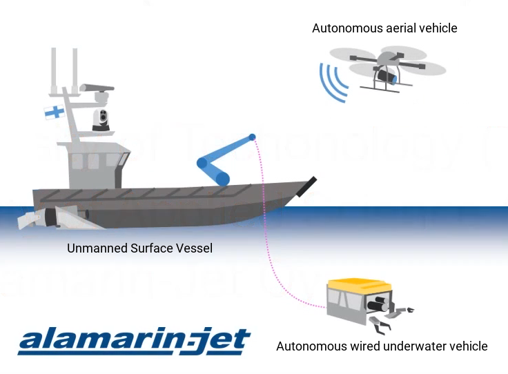

# Issues and Goals

## The aCOLOR project

Autonomous robotic systems become more important in many industries. They started with the automation of basic tasks to lead currently to the automation of more and more elaborate ones. These robotic systems can provide a way to execute tasks faster and more safely than any human operator. In the context of a marine area, these tasks cover water exploration to underwater mining and inspection,  borderline guarding to search and rescue victim in water area. 

The Autonomous and Collaborative Offshore Robotics \(aCOLOR\) is a project started in January 2018 is a collaboration of Tampere University of Technology \(TUT\), Tampere University of Applied Science \(TAMK\) and Alamarin-Jet Oy, a Finnish water jet manufacturer. It is a three-year project ending in 2020 founding by the European Union. The aim of the project is to combine three autonomous vehicles, one in each elements air, underwater and surface in order to achieve complete offshore inspection with one autonomous system. Indeed the global autonomous system includes an aerial vehicle, an autonomous wired underwater vehicle and a Unmanned Surface Vessel \(USV\).  

The project began by the automation the surface vessels furnished by Alamarin-Jet Oy. This USV  is equipped with multiple sensors to evolve remotely and explore surface. After one and a half year, the USV is able to achieve waypoint navigation and a obstacle avoidance in under development. Furthermore, it possess an actively controlled directional antenna to allow hi-speed, wireless and long-range communication to a Ground Control Station. The USV is also employed as launch and recovery platform for a drone and an underwater vehicle, remotely connect to the boat by a wire. These two other systems will provide air and underwater inspections.   

## BlueRov2 in the aCOLOR project

The mission of autonomous wired underwater vehicle is to provide underwater data such as camera stream and cloud points of its near environment. The aims for this vehicle is to evolve in a ray of 500m around the USV and to dive up to 500m depth. The autonomous wired underwater vehicle purchased by the team before my internship was a complete Remotely Operated Vehicle \(ROV\) named BlueRov2 made by the company Bluerobotics. It's a fully equipped ROV, ready to dive. I will explain how it works in a subsequent part of this report. Yet, this ROV doesn't fit the specification because its maximum depth is 300m and the tether linking him to the USV is 100m length. Hence a new frame will be developed for the ROV and the tether will be replace by a optical fiber one of 500m length.

## The team

This project require a large specter of competences and many team were and will be involved to build up the project at the horizon 2020 :



Prof. Kari T. Koskinen, TUT  
Dr. Jussi Aaltonen, TUT  
Prof. Moncef Gabbouj, TUT  
Prof. Mikko Valkama, TUT  
Doctoral Student Jose Villa Escusol, TUT  
Research Assistant Samuli Niemi, TUT  
Master Student Aleksi Kuusisto, TUT  
Master Student Gauthier Bussy, CESI Pau  
Master Student Cyril Cotsaftis, ENSTA Bretagne  
Master Student Nathan Fourniol, ENSTA Bretagne  
Master Student Arnaud Salles-Thomas, CESI Pau  
  
  



Sauli Virta



Dr. Markus Aho



## The BlueRov2 team

During this summer, from June to September, aCOLOR project hired four french student for working on the underwater part of the project :

* Gauthier Bussy from CESI Pau, France Mechanical engineer student
* Arnaud Salles-Thomas from CESI Pau, France, Mechanical engineer student
* Cyril Cotsaftis from ENSTA Bretagne, France, Robotic engineer student
* I, Nathan Fourniol from ENSTA Bretagne, France, Robotic engineer student

## Issues and Goals of this internship

## Work organization

Gauthier, Cyril and I started the internship at TUT in Tampere on June 5 and we finished on August 30 while Arnaud joined us on August 11 and he staid until October. According to our field of study and our competence, Gauthier worked on a launch and recovery system for the ROV to put it in the water from the USV. Arnaud designed a new frame for the ROV while Cyril and I worked on the ROS implementation and the control laws to automate the BlueRov2. Cyril built command laws and I take charge of linking sensors, ROV and ROS.

